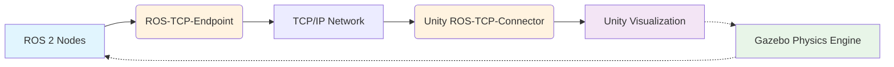

# Chapter 8: High-Fidelity Rendering with Unity

## Unity as the "Visual Experience" Layer

Unity serves as the "Visual Experience" in the digital twin paradigm, providing exceptional visual fidelity for robotics simulation through the ROS-TCP-Connector. While Gazebo handles the "Physics Truth" (dynamics, collisions, and real physics calculations), Unity focuses on the visual representation, creating photorealistic scenarios for human-robot interaction testing without performing physics calculations itself.

## Bridging ROS 2 to Unity

The ROS-TCP-Connector enables real-time communication between ROS 2 nodes and Unity environments, allowing Unity to visualize the physics truth computed in Gazebo. This separation prevents synchronization lag that would occur if both systems ran physics simultaneously.



The above diagram illustrates the communication flow: ROS 2 nodes publish robot state information to the ROS-TCP-Endpoint, which transmits the data over TCP/IP to Unity's ROS-TCP-Connector. Unity then visualizes this data in real-time. The dotted lines represent the feedback loop where Gazebo computes the physics truth that influences both ROS 2 nodes and Unity visualization.

## Setting Up ROS-TCP-Connector

The ROS-TCP-Connector facilitates communication between ROS 2 and Unity through TCP/IP sockets. The setup involves:

1. **Installing the ROS-TCP-Endpoint**: A ROS 2 package that acts as the communication bridge
2. **Configuring network settings**: Ensuring both ROS 2 and Unity can communicate
3. **Defining message types**: Mapping ROS 2 messages to Unity components

## Unity Environment Setup

To create high-fidelity environments for humanoid robots in Unity:

- **Lighting systems**: Use realistic lighting to simulate different time-of-day conditions
- **Material properties**: Apply physically-based rendering (PBR) materials for accurate visual representation
- **Environmental assets**: Include detailed models of real-world spaces like offices, homes, or factories

## Visualizing Human-Robot Interaction

Unity excels at creating photorealistic environments for testing human-robot interaction scenarios:

- **Avatar systems**: Realistic human avatars for interaction testing
- **Gesture recognition**: Visual feedback for gesture-based communication
- **Social navigation**: Testing how robots navigate around humans in shared spaces

## GPU Requirements for Rendering

High-fidelity rendering requires significant computational resources, particularly:

- **NVIDIA RTX Series GPUs**: Recommended for real-time ray tracing and advanced rendering
- **VRAM**: Minimum 8GB recommended, 16GB+ for complex environments
- **Compute capability**: CUDA cores for physics simulation and rendering acceleration

## Integration Patterns

Common integration patterns for ROS 2 and Unity include:

- **Publisher-Subscriber**: ROS 2 nodes publish robot states, Unity subscribes to visualize
- **Service calls**: Unity requests specific actions from ROS 2 services
- **Action servers**: Long-running tasks with feedback, such as navigation

## C# Unity-ROS Integration Example

For Unity-side telemetry, here's an example C# template using the ROS-TCP-Connector for ROS 2 Humble:

```csharp
using System.Collections;
using UnityEngine;
using Unity.Robotics.ROSTCPConnector;
using Unity.Robotics.ROSTCPConnector.MessageGeneration;
using Unity.Robotics.ROSTCPConnector.ROSGeometry;

public class RobotTelemetryPublisher : MonoBehaviour
{
    ROSConnection ros;
    string rosTopicName = "unity_telemetry";

    // Robot state data
    public float positionX, positionY, positionZ;
    public float rotationX, rotationY, rotationZ, rotationW;

    // Start is called before the first frame update
    void Start()
    {
        // Get the ROS connection static instance
        ros = ROSConnection.GetOrCreateInstance();
        ros.RegisterPublisher<UnityTelemetryMsg>(rosTopicName);
    }

    // Update is called once per frame
    void Update()
    {
        // Get current robot state
        UpdateRobotState();

        // Create and publish telemetry message
        var telemetryMsg = new UnityTelemetryMsg
        {
            header = new std_msgs.Header { stamp = new builtin_interfaces.Time { sec = (int)Time.time, nanosec = 0 } },
            position = new geometry_msgs.Point { x = positionX, y = positionY, z = positionZ },
            orientation = new geometry_msgs.Quaternion { x = rotationX, y = rotationY, z = rotationZ, w = rotationW }
        };

        // Publish the message
        ros.Publish(rosTopicName, telemetryMsg);
    }

    void UpdateRobotState()
    {
        // Update position and orientation from robot GameObject
        positionX = transform.position.x;
        positionY = transform.position.y;
        positionZ = transform.position.z;

        rotationX = transform.rotation.x;
        rotationY = transform.rotation.y;
        rotationZ = transform.rotation.z;
        rotationW = transform.rotation.w;
    }
}
```

:::info
**Physics Tip**: When using the Unity ROS-TCP-Connector with ROS 2 Humble, ensure you're using the correct message types and namespaces. The Unity Robotics Package is optimized for ROS 2 Humble and provides efficient serialization for real-time applications.
:::

## Performance Optimization

To maintain high frame rates in Unity while processing ROS 2 data:

- **LOD (Level of Detail) systems**: Reduce complexity for distant objects
- **Occlusion culling**: Don't render objects not visible to the camera
- **Optimized physics**: Use simplified collision meshes for real-time performance

## Visual Sensor Simulation

Unity can simulate various visual sensors:

- **RGB cameras**: High-resolution visual feedback
- **Depth cameras**: Realistic depth information for 3D reconstruction
- **Semantic segmentation**: Pixel-perfect labeling for perception training

## Best Practices

1. **Separate visualization from physics**: Use Unity for rendering, Gazebo for physics simulation
2. **Network optimization**: Minimize data transfer between ROS 2 and Unity
3. **Consistent time management**: Synchronize simulation time between both systems
4. **Scalable environments**: Design environments that can be easily modified

---

Next Chapter: [Chapter 9 - Virtual Sensors & Data](./09-virtual-sensors-data.md)