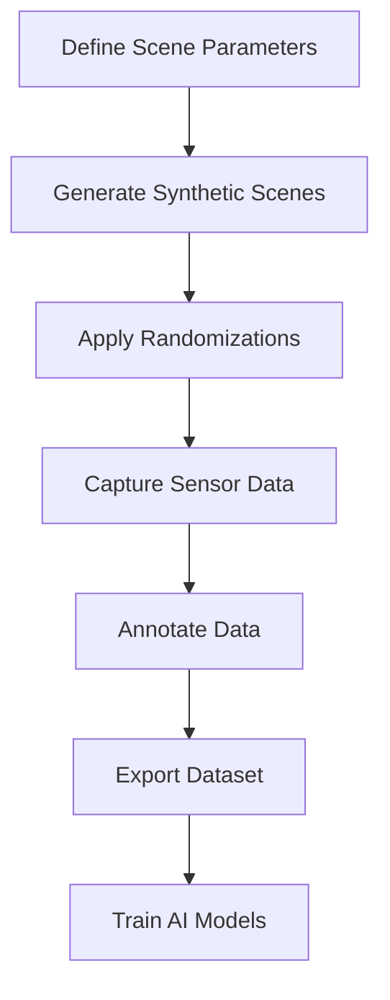

# Synthetic Data Generation (SDG)

## Overview

This chapter covers the generation of synthetic data using NVIDIA Isaac Sim for training AI models without requiring real-world images. Synthetic Data Generation (SDG) is a critical component in robotics development, enabling the creation of diverse, labeled datasets that would be expensive or impossible to collect in the real world.

## Key Topics

- Principles of synthetic data generation
- Setting up Isaac Sim for SDG
- Creating diverse datasets
- Quality assessment of synthetic data
- Integration with ML training pipelines

## SDG Workflow



## Benefits of Synthetic Data

- Reduced dependency on real-world data collection
- Controlled environment for testing
- Cost-effective data generation
- Privacy-safe data creation

## Setting up Isaac Sim for SDG

To set up Isaac Sim for Synthetic Data Generation, you'll need to configure the following components:

### Domain Randomization

Domain randomization is the process of varying environmental parameters to create diverse synthetic datasets:

```python
# Example Python script for domain randomization in Isaac Sim
import omni
from omni.isaac.core import World
from omni.isaac.core.utils.stage import add_reference_to_stage
import numpy as np

def setup_domain_randomization():
    """
    Set up domain randomization for synthetic data generation
    This function demonstrates how to randomize various scene parameters
    """
    # Randomize lighting conditions
    def randomize_lighting():
        # Randomize light intensity and color
        light_intensity = np.random.uniform(500, 2000)
        light_color = [np.random.uniform(0.8, 1.2), np.random.uniform(0.8, 1.2), np.random.uniform(0.8, 1.2)]
        return light_intensity, light_color

    # Randomize object textures and materials
    def randomize_materials():
        # Randomize surface properties
        roughness = np.random.uniform(0.1, 0.9)
        metallic = np.random.uniform(0.0, 0.5)
        return roughness, metallic

    # Randomize camera positions and angles
    def randomize_camera():
        # Randomize camera position and orientation
        position = [np.random.uniform(-5, 5), np.random.uniform(-5, 5), np.random.uniform(1, 3)]
        rotation = [np.random.uniform(-0.5, 0.5), np.random.uniform(-0.5, 0.5), np.random.uniform(-3.14, 3.14)]
        return position, rotation

    return randomize_lighting, randomize_materials, randomize_camera

def generate_1000_robot_poses():
    """
    Generate 1000+ randomized robot poses for synthetic data collection
    """
    poses = []
    for i in range(1000):
        # Randomize robot position
        position = [np.random.uniform(-2, 2), np.random.uniform(-2, 2), 0.0]
        # Randomize robot orientation
        rotation = [0, 0, np.random.uniform(-3.14, 3.14)]
        # Randomize joint angles
        joint_angles = [np.random.uniform(-1.57, 1.57) for _ in range(6)]  # Assuming 6 DOF robot

        pose = {
            'id': i,
            'position': position,
            'rotation': rotation,
            'joint_angles': joint_angles
        }
        poses.append(pose)

    return poses

# Example usage
if __name__ == "__main__":
    # Initialize Isaac Sim world
    world = World(stage_units_in_meters=1.0)

    # Setup domain randomization
    lighting_func, materials_func, camera_func = setup_domain_randomization()

    # Generate robot poses
    robot_poses = generate_1000_robot_poses()

    print(f"Generated {len(robot_poses)} randomized robot poses for synthetic data collection")

    # Add robot to stage and set poses
    # add_reference_to_stage(usd_path="/path/to/robot.usd", prim_path="/World/Robot")