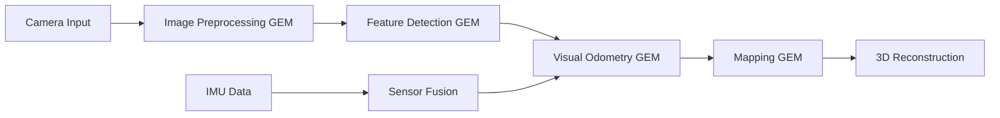

# Isaac ROS & Hardware Acceleration

## Overview

This chapter covers hardware-accelerated Visual SLAM using Isaac ROS GEMs and NvBlox for 3D reconstruction. Isaac ROS provides GPU-accelerated perception and navigation capabilities that are essential for real-time robotics applications.

## Key Topics

- Isaac ROS GEMs overview
- Visual SLAM implementation
- Hardware acceleration with GPUs
- NvBlox 3D reconstruction
- Performance optimization

## Isaac ROS GEMs Overview

Isaac ROS GEMs (GPU-accelerated Extension Modules) are optimized packages that leverage NVIDIA GPUs for accelerated perception and navigation:

- **Isaac ROS Apriltag**: GPU-accelerated AprilTag detection
- **Isaac ROS Stereo DNN**: Deep neural network inference for stereo vision
- **Isaac ROS Visual Slam**: Hardware-accelerated visual SLAM
- **Isaac ROS NvBlox**: GPU-accelerated 3D scene reconstruction
- **Isaac ROS Image Proc**: GPU-accelerated image processing

### Isaac ROS Visual SLAM Implementation

```python
# Example Isaac ROS Visual SLAM implementation
import rclpy
from rclpy.node import Node
from sensor_msgs.msg import Image, CameraInfo
from geometry_msgs.msg import PoseStamped
from nav_msgs.msg import Odometry
import cv2
import numpy as np

class IsaacROSVisualSLAM(Node):
    def __init__(self):
        super().__init__('isaac_ros_visual_slam')

        # Subscribe to camera topics
        self.image_sub = self.create_subscription(
            Image,
            '/camera/color/image_raw',
            self.image_callback,
            10
        )

        self.camera_info_sub = self.create_subscription(
            CameraInfo,
            '/camera/color/camera_info',
            self.camera_info_callback,
            10
        )

        # Publisher for pose estimates
        self.pose_pub = self.create_publisher(
            PoseStamped,
            '/visual_slam/pose',
            10
        )

        # Publisher for odometry
        self.odom_pub = self.create_publisher(
            Odometry,
            '/visual_slam/odometry',
            10
        )

        # Initialize SLAM components
        self.initialize_slam()

    def initialize_slam(self):
        """Initialize the Visual SLAM components"""
        # Initialize feature detector
        self.feature_detector = cv2.ORB_create()

        # Initialize pose estimator
        self.previous_pose = np.eye(4)
        self.current_pose = np.eye(4)

        # Initialize map
        self.map_points = []

    def image_callback(self, msg):
        """Process incoming image for SLAM"""
        # Convert ROS image to OpenCV format
        image = self.ros_to_cv2(msg)

        # Extract features
        keypoints, descriptors = self.feature_detector.detectAndCompute(image, None)

        # Perform visual odometry
        pose_update = self.visual_odometry(keypoints, descriptors)

        # Update pose
        if pose_update is not None:
            self.current_pose = np.dot(self.current_pose, pose_update)

            # Publish pose
            self.publish_pose()

    def visual_odometry(self, keypoints, descriptors):
        """Perform visual odometry to estimate pose change"""
        # Implementation of visual odometry algorithm
        # This would typically use GPU-accelerated computation in Isaac ROS
        pass

    def ros_to_cv2(self, ros_image):
        """Convert ROS image message to OpenCV format"""
        # Convert ROS image to OpenCV format
        # This would typically be handled by Isaac ROS image transport
        pass

    def publish_pose(self):
        """Publish current pose estimate"""
        pose_msg = PoseStamped()
        pose_msg.header.stamp = self.get_clock().now().to_msg()
        pose_msg.header.frame_id = 'map'

        # Set position
        pose_msg.pose.position.x = self.current_pose[0, 3]
        pose_msg.pose.position.y = self.current_pose[1, 3]
        pose_msg.pose.position.z = self.current_pose[2, 3]

        # Set orientation (convert rotation matrix to quaternion)
        # Implementation for quaternion conversion

        self.pose_pub.publish(pose_msg)

def main(args=None):
    rclpy.init(args=args)
    visual_slam_node = IsaacROSVisualSLAM()

    try:
        rclpy.spin(visual_slam_node)
    except KeyboardInterrupt:
        pass
    finally:
        visual_slam_node.destroy_node()
        rclpy.shutdown()

if __name__ == '__main__':
    main()
```

## Isaac ROS GEMs Communication Flow



## NvBlox 3D Reconstruction

NvBlox is Isaac ROS's GPU-accelerated 3D scene reconstruction system:

### NvBlox Configuration

```yaml
# Example NvBlox configuration for 3D reconstruction
nvblox_node:
  ros__parameters:
    # Map parameters
    tsdf_radius_voxels: 8
    tsdf_voxel_size_meters: 0.05
    max_integration_distance_m: 5.0

    # GPU parameters
    use_gpu: true
    gpu_device_id: 0

    # Sensor parameters
    truncation_distance_m: 0.3
    max_weight: 100.0

    # Mesh generation
    mesh_min_weight: 10.0
    enable_mesh_output: true
```

## Performance Optimization Techniques

### GPU Memory Management

```cpp
// Example C++ code for Isaac ROS VSLAM optimization
#include <cuda_runtime.h>
#include <nvblox/nvblox.h>
#include <nvblox/core/layer.h>
#include <nvblox/integrators/tsdf_integrator.h>

class OptimizedVslamNode {
public:
    OptimizedVslamNode() {
        // Initialize GPU memory pools
        initializeMemoryPools();

        // Configure CUDA streams for parallel processing
        setupCudaStreams();
    }

private:
    void initializeMemoryPools() {
        // Pre-allocate GPU memory to avoid runtime allocation overhead
        cudaMalloc(&gpu_memory_pool_, kMemoryPoolSize);

        // Initialize pinned memory for faster CPU-GPU transfers
        cudaHostAlloc(&pinned_memory_, kPinnedMemorySize, cudaHostAllocDefault);
    }

    void setupCudaStreams() {
        // Create CUDA streams for parallel processing
        cudaStreamCreate(&image_processing_stream_);
        cudaStreamCreate(&slam_stream_);
        cudaStreamCreate(&rendering_stream_);
    }

    // GPU memory pool
    void* gpu_memory_pool_;
    void* pinned_memory_;

    // CUDA streams for parallel execution
    cudaStream_t image_processing_stream_;
    cudaStream_t slam_stream_;
    cudaStream_t rendering_stream_;

    static constexpr size_t kMemoryPoolSize = 1024 * 1024 * 100;  // 100MB
    static constexpr size_t kPinnedMemorySize = 1024 * 1024 * 10; // 10MB
};
```

## Hardware Acceleration Benefits

- Real-time processing on Jetson platforms
- GPU-accelerated computer vision
- Optimized memory usage
- Power-efficient operation

## Cross-Module Connection: From Simulation to Real Perception

The hardware-accelerated perception capabilities in this chapter directly connect to the synthetic data generation from Chapter 12 and the sensor simulation concepts from Module 2. The Isaac ROS GEMs can process both:

- **Synthetic sensor data** generated in Isaac Sim (Module 3, Chapter 12) for training perception models
- **Real sensor data** from physical robots, processed with the same GPU-accelerated algorithms

This creates a complete pipeline from digital twin simulation (Module 2) through synthetic data generation (Module 3, Chapter 12) to real-world perception (this chapter).