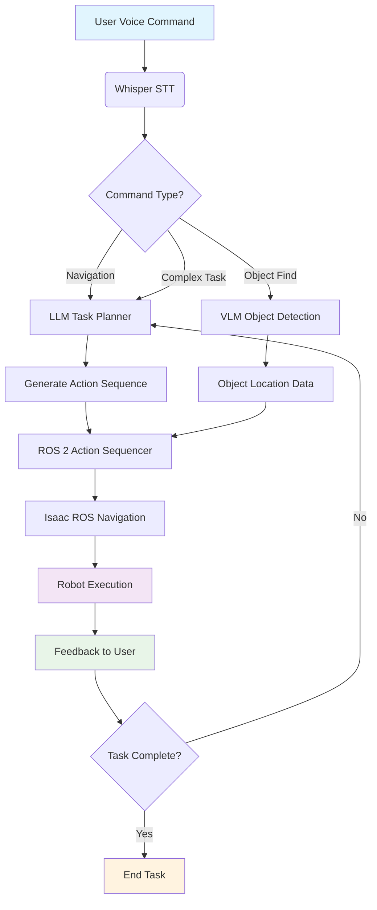
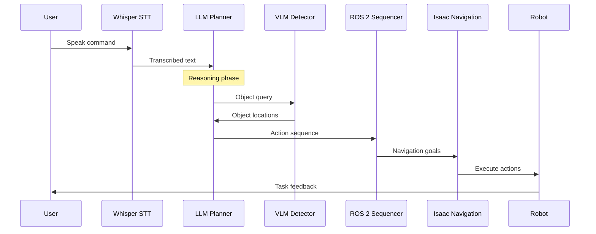

# Capstone Part A - The Unified Architecture

## Overview

This chapter focuses on connecting all components learned in previous modules: the Brain (Isaac), Body (URDF/Gazebo), and Voice (Whisper). We'll design the unified architecture that brings together the entire system into a cohesive autonomous humanoid.

## System Integration Map

The Vision-Language-Action (VLA) system integrates four major components in a unified pipeline:

```
┌─────────────────┐    ┌──────────────────┐    ┌──────────────────┐
│   User Voice    │    │  LLM Reasoning   │    │  VLM Perception  │
│   Command       │───▶│  (Task Planner)  │───▶│  (Object Finder) │
│                 │    │                  │    │                  │
│ "Go get the     │    │ - Task breakdown │    │ - Object         │
│  red cup"       │    │ - Action seq.    │    │   detection      │
│                 │    │ - Safety checks  │    │ - Spatial loc.   │
└─────────────────┘    └──────────────────┘    └──────────────────┘
         │                       │                       │
         ▼                       ▼                       ▼
┌─────────────────┐    ┌──────────────────┐    ┌──────────────────┐
│ Whisper Speech  │    │ ROS 2 Action     │    │ Isaac ROS        │
│ Recognition     │    │ Sequencer        │    │ Navigation       │
│                 │    │                  │    │                  │
│ - Audio input   │    │ - Nav goals      │    │ - Path planning  │
│ - Noise reduc.  │    │ - Manipulation   │    │ - Obstacle avoid.│
│ - Text output   │    │ - Coordination   │    │ - Execution      │
└─────────────────┘    └──────────────────┘    └──────────────────┘
         │                       │                       │
         └───────────────────────┼───────────────────────┘
                                 ▼
                    ┌─────────────────────────┐
                    │   Robot Execution       │
                    │   (Physical Actions)    │
                    │                         │
                    │ - Navigation            │
                    │ - Manipulation          │
                    │ - Feedback to user      │
                    └─────────────────────────┘
```

## Component Interaction Diagrams

### Mermaid.js Flowchart: Complete VLA Pipeline



### Mermaid.js: Real-time Processing Pipeline



## Action Loop Implementation

The core "Action Loop" follows this pattern:

```
Audio (Whisper) -> Text (LLM) -> Planner (Action Server) -> Execute (Nav2/Perception)
```

### Implementation Code

```python
import rclpy
from rclpy.node import Node
from std_msgs.msg import String
from sensor_msgs.msg import Image
import json
import threading
import queue

class VLAMasterOrchestrator(Node):
    def __init__(self):
        super().__init__('vla_orchestrator')

        # Publishers and subscribers
        self.voice_sub = self.create_subscription(String, 'voice_commands', self.voice_callback, 10)
        self.image_sub = self.create_subscription(Image, '/camera/rgb/image_raw', self.image_callback, 10)
        self.llm_pub = self.create_publisher(String, 'llm_requests', 10)
        self.vlm_pub = self.create_publisher(String, 'vlm_requests', 10)
        self.action_pub = self.create_publisher(String, 'action_sequence', 10)

        # Internal queues for processing
        self.voice_queue = queue.Queue()
        self.image_queue = queue.Queue()

        # Processing thread
        self.processing_thread = threading.Thread(target=self.process_loop)
        self.processing_thread.daemon = True
        self.processing_thread.start()

        self.get_logger().info("VLA Master Orchestrator initialized")

    def voice_callback(self, msg):
        """Handle incoming voice commands"""
        self.get_logger().info(f"Received voice command: {msg.data}")
        self.voice_queue.put(msg.data)

    def image_callback(self, msg):
        """Handle incoming images for VLM processing"""
        # In a real implementation, we'd process the image
        # For now, we just store it for later use
        self.image_queue.put(msg)

    def process_loop(self):
        """Main processing loop"""
        while rclpy.ok():
            try:
                # Process voice commands
                if not self.voice_queue.empty():
                    voice_command = self.voice_queue.get()
                    self.process_voice_command(voice_command)

                # Process images for VLM
                if not self.image_queue.empty():
                    image_msg = self.image_queue.get()
                    # Process image in background
                    threading.Thread(target=self.process_image, args=(image_msg,)).start()

                # Small delay to prevent busy waiting
                import time
                time.sleep(0.01)

            except Exception as e:
                self.get_logger().error(f"Error in processing loop: {e}")

    def process_voice_command(self, command):
        """Process voice command through LLM"""
        # Create LLM request
        llm_request = {
            "command": command,
            "context": "robotic_task_planning",
            "required_outputs": ["action_sequence", "object_targets", "navigation_goals"]
        }

        # Send to LLM for processing
        msg = String()
        msg.data = json.dumps(llm_request)
        self.llm_pub.publish(msg)
        self.get_logger().info(f"Sent LLM request for command: {command}")

    def process_image(self, image_msg):
        """Process image for VLM object detection"""
        # Create VLM request
        vlm_request = {
            "image_available": True,
            "object_detection_needed": True,
            "context": "environment_perception"
        }

        # Send to VLM for processing
        msg = String()
        msg.data = json.dumps(vlm_request)
        self.vlm_pub.publish(msg)

    def llm_response_callback(self, msg):
        """Handle LLM responses with action sequences"""
        try:
            response_data = json.loads(msg.data)
            action_sequence = response_data.get("action_sequence", [])

            if action_sequence:
                # Publish action sequence to execution system
                action_msg = String()
                action_msg.data = json.dumps(action_sequence)
                self.action_pub.publish(action_msg)
                self.get_logger().info(f"Published action sequence with {len(action_sequence)} actions")
        except json.JSONDecodeError as e:
            self.get_logger().error(f"Failed to parse LLM response: {e}")

def main(args=None):
    rclpy.init(args=args)
    orchestrator = VLAMasterOrchestrator()

    # Add LLM response subscription
    orchestrator.llm_response_sub = orchestrator.create_subscription(
        String,
        'llm_responses',
        orchestrator.llm_response_callback,
        10
    )

    try:
        rclpy.spin(orchestrator)
    except KeyboardInterrupt:
        pass
    finally:
        orchestrator.destroy_node()
        rclpy.shutdown()

if __name__ == '__main__':
    main()
```

## Master Launch File

Here's the "Master Launch" file that initializes all nodes simultaneously:

```xml
<!-- vla_system.launch.py -->
from launch import LaunchDescription
from launch_ros.actions import Node
from launch.actions import DeclareLaunchArgument
from launch.substitutions import LaunchConfiguration
from ament_index_python.packages import get_package_share_directory
import os

def generate_launch_description():
    return LaunchDescription([
        # Whisper Voice Node
        Node(
            package='whisper_voice_control',
            executable='whisper_node',
            name='whisper_voice_node',
            output='screen',
            parameters=[
                {'model_size': 'base'},
                {'sample_rate': 16000},
            ]
        ),

        # LLM Task Planner Node
        Node(
            package='llm_task_planner',
            executable='llm_task_planner_node',
            name='llm_task_planner_node',
            output='screen',
            parameters=[
                {'model_type': 'ollama'},
                {'model_name': 'llama3:70b'},
            ]
        ),

        # VLM Detection Node
        Node(
            package='vlm_detector',
            executable='vlm_detection_node',
            name='vlm_detection_node',
            output='screen',
            parameters=[
                {'model_type': 'clip'},
                {'confidence_threshold': 0.7},
            ]
        ),

        # Isaac Navigation Node
        Node(
            package='isaac_ros_navigation',
            executable='navigation_node',
            name='navigation_node',
            output='screen',
            parameters=[
                {'use_sim_time': False},
            ]
        ),

        # VLA Master Orchestrator
        Node(
            package='vla_system',
            executable='vla_orchestrator',
            name='vla_orchestrator',
            output='screen'
        ),
    ])
```

## Hardware Integration Considerations

### NVIDIA Jetson Orin Deployment

For edge deployment on NVIDIA Jetson Orin:

```python
# Hardware-specific optimizations
class JetsonOptimizedVLA:
    def __init__(self):
        # Use TensorRT for optimized inference
        self.use_tensorrt = True

        # Optimize for limited memory
        self.max_batch_size = 1  # Process one frame at a time

        # Enable hardware acceleration
        self.enable_gpu_processing = True
        self.enable_dla = True  # Deep Learning Accelerator

        # Power management
        self.enable_power_optimization = True
```

### RTX GPU Simulation

For simulation with RTX GPU:

```python
# Simulation-specific optimizations
class RTXOptimizedVLA:
    def __init__(self):
        # Enable multi-GPU processing
        self.enable_multi_gpu = True

        # Higher batch sizes for better throughput
        self.max_batch_size = 8

        # Enable advanced rendering
        self.enable_ray_tracing = True
        self.enable_advanced_physics = True
```

## Integration Validation

### Component Health Check

```python
def validate_system_integration(self):
    """Validate that all components are properly connected"""
    checks = {
        "whisper_node": self.check_node_health("whisper_voice_node"),
        "llm_node": self.check_node_health("llm_task_planner_node"),
        "vlm_node": self.check_node_health("vlm_detection_node"),
        "navigation_node": self.check_node_health("navigation_node"),
        "orchestrator": self.check_node_health("vla_orchestrator")
    }

    all_healthy = all(checks.values())

    if all_healthy:
        self.get_logger().info("All VLA components are healthy and connected")
    else:
        unhealthy = [name for name, healthy in checks.items() if not healthy]
        self.get_logger().error(f"Unhealthy components: {unhealthy}")

    return all_healthy
```

## Performance Monitoring

Monitor the complete VLA pipeline performance:

- **Voice-to-action latency**: Should be `<3` seconds end-to-end
- **Object detection accuracy**: Should be >85% for known objects
- **Navigation success rate**: Should be >90% for clear paths
- **System resource usage**: Should stay within hardware limits

This unified architecture provides the foundation for a complete Vision-Language-Action system that can understand natural language commands, perceive its environment, and execute complex robotic tasks autonomously.